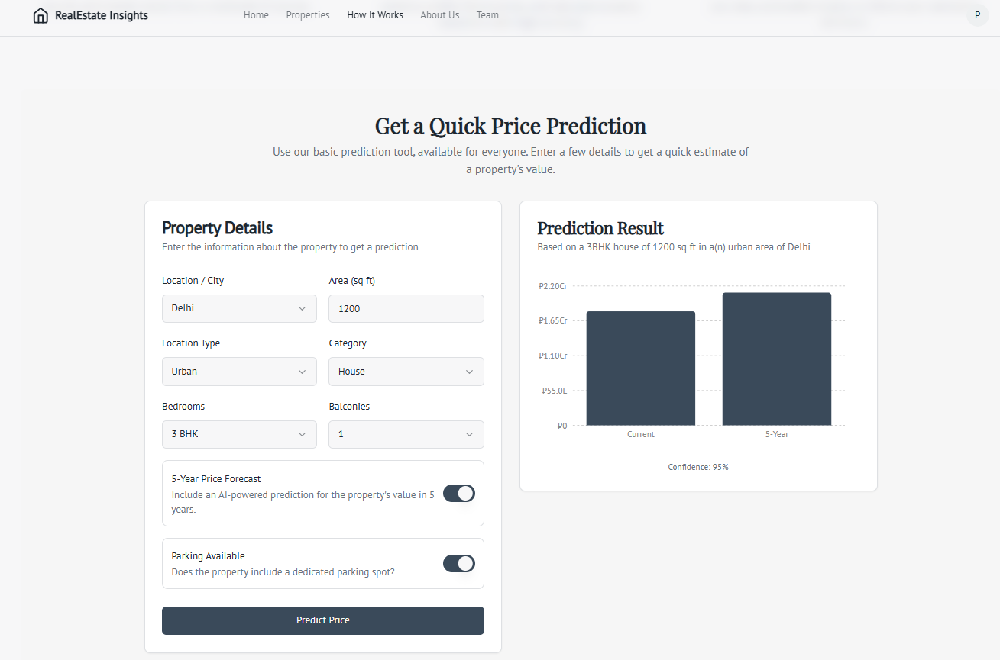

# 🏠 Real Estate Insights — House Price Prediction Analysis

---

## 💡 About the Project

**Real Estate Insights** is an AI-powered web application that predicts house prices based on inputs such as:
- Location  
- Area (sq. ft.)  
- Number of Bedrooms (BHK)  
- Amenities  

Built with **Next.js** and **TypeScript** on the frontend and powered by a **Flask** backend for machine learning predictions, this project helps users make smarter real estate decisions through automation and data intelligence.

---

## 🚀 Features

✅ Real-time house price prediction using AI  
✅ Clean and responsive user interface (Tailwind CSS)  
✅ Interactive property listings and charts  
✅ Modular and scalable project structure  
✅ Fast data processing through Flask API  
✅ Fully mobile-friendly design  

---

## 📸 Project Preview

### 🏠 Home Page  
Here’s a look at the landing screen that introduces users to our AI-powered real estate platform:

---

### 💰 Prediction Page  
This page allows users to enter property details and instantly get an accurate price prediction:

---

## 🧠 How It Works

1️⃣ The user fills the **prediction form** (location, area, BHK, etc.).  
2️⃣ Data is sent to the **Flask backend API**.  
3️⃣ The trained **AI model** processes the data and predicts the price.  
4️⃣ The **Next.js frontend** displays the result dynamically using charts and styled components.  

---

## 🧩 Tech Stack

| Layer | Technologies |
|--------|--------------|
| **Frontend** | Next.js, React, TypeScript, Tailwind CSS |
| **Backend** | Flask (Python), REST API |
| **AI Model** | Linear Regression / Random Forest |
| **Visualization** | Chart.js |
| **Version Control** | Git & GitHub |
